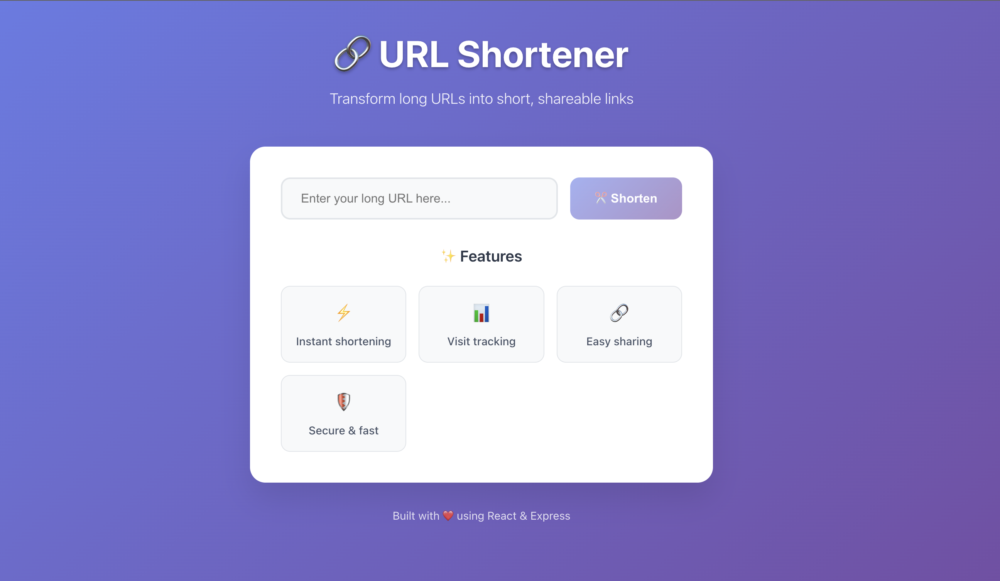

# 🔗 URL Shortener

A complete, full-stack URL shortening application built with React and Express.js, featuring a minimalist design and real-time analytics.



## ✨ Features

### 🎯 Core Functionality
- **URL Shortening**: Convert long URLs into short, shareable links
- **Visit Tracking**: Real-time analytics with visit counters
- **Instant Redirect**: Fast redirection to original URLs
- **Deduplication**: Same URLs get the same short code
- **Copy to Clipboard**: One-click copying functionality

### 🎨 Design & UX
- **Minimalist Design**: Clean, modern interface
- **Responsive Layout**: Works on desktop, tablet, and mobile
- **Beautiful Gradients**: Purple-blue gradient theme
- **Smooth Animations**: Hover effects and transitions
- **Accessibility**: WCAG compliant with keyboard navigation

### 🚀 Technical Features
- **Real-time Analytics**: Live visit tracking
- **Error Handling**: Comprehensive error management
- **Rate Limiting**: API protection against abuse
- **Security Headers**: Helmet.js for security
- **CORS Support**: Cross-origin resource sharing
- **Input Validation**: URL format validation

## 🏗️ Architecture

```
Shorten-Url/
├── client/                 # React Frontend
│   ├── src/
│   │   ├── App.jsx        # Main component
│   │   ├── App.css        # Styling
│   │   └── index.css      # Global styles
│   └── package.json       # Frontend dependencies
├── server/                # Express Backend
│   ├── index.js          # Main server file
│   ├── package.json      # Backend dependencies
│   └── test.js           # API tests
└── README.md             # This file
```

## 🚀 Quick Start

### Prerequisites
- Node.js 18+ 
- npm or yarn

### Installation

1. **Clone the repository**
```bash
git clone <your-repo-url>
cd Shorten-Url
```

2. **Install Backend Dependencies**
```bash
cd server
npm install
```

3. **Install Frontend Dependencies**
```bash
cd ../client
npm install
```

4. **Start the Backend Server**
```bash
cd ../server
npm start
```
The backend will run on `http://localhost:3000`

5. **Start the Frontend Development Server**
```bash
cd ../client
npm run dev
```
The frontend will run on `http://localhost:5173`

6. **Open your browser**
Navigate to `http://localhost:5173` to use the application!

## 🛠️ Technology Stack

### Frontend
- **React 19**: Latest React with modern hooks
- **Vite**: Fast build tool and dev server
- **Axios**: HTTP client for API communication
- **CSS3**: Modern styling with gradients and animations

### Backend
- **Express.js**: Fast, unopinionated web framework
- **Node.js**: JavaScript runtime
- **In-Memory Database**: JavaScript Map for temporary storage
- **Security**: Helmet.js, CORS, Rate limiting

### Development Tools
- **ESLint**: Code linting and formatting
- **Nodemon**: Auto-restart for development
- **Vite**: Hot module replacement

## 📊 API Documentation

### Endpoints

| Method | Endpoint | Description |
|--------|----------|-------------|
| `POST` | `/api/shorten` | Create short URL |
| `GET` | `/:shortCode` | Redirect to original URL |
| `GET` | `/api/analytics/:shortCode` | Get URL analytics |
| `GET` | `/api/urls` | Get all URLs |
| `DELETE` | `/api/urls/:shortCode` | Delete short URL |
| `GET` | `/health` | Health check |

### Example Usage

**Create Short URL:**
```bash
curl -X POST http://localhost:3000/api/shorten \
  -H "Content-Type: application/json" \
  -d '{"url": "https://www.example.com"}'
```

**Get Analytics:**
```bash
curl http://localhost:3000/api/analytics/abc12345
```

## 🎯 Usage Guide

### For Users

1. **Enter URL**: Type any long URL in the input field
2. **Shorten**: Click the "Shorten" button
3. **Copy**: Click "Copy" to copy the short URL
4. **Share**: Share the short URL with others
5. **Track**: View analytics and visit counts

### For Developers

**Frontend Development:**
```bash
cd client
npm run dev          # Start development server
npm run build        # Build for production
npm run preview      # Preview production build
```

**Backend Development:**
```bash
cd server
npm start            # Start production server
npm run dev          # Start with nodemon
node test.js         # Run API tests
```

## 🔧 Configuration

### Environment Variables

**Backend (.env):**
```env
PORT=3000
NODE_ENV=development
```

**Frontend (vite.config.js):**
```javascript
export default {
  server: {
    port: 5173,
    proxy: {
      '/api': 'http://localhost:3000'
    }
  }
}
```

## 📈 Performance

- **Frontend**: Optimized with Vite for fast builds
- **Backend**: Express.js with minimal overhead
- **Database**: In-memory storage for instant access
- **Caching**: Built-in browser caching
- **Bundle Size**: Minimal dependencies

## 🔒 Security Features

- **Rate Limiting**: 100 requests per 15 minutes
- **Input Validation**: URL format checking
- **CORS**: Cross-origin resource sharing
- **Helmet.js**: Security headers
- **Error Handling**: No sensitive data exposure

## 🧪 Testing

**Run API Tests:**
```bash
cd server
node test.js
```

**Test Endpoints:**
- Health check: `GET /health`
- URL shortening: `POST /api/shorten`
- Analytics: `GET /api/analytics/:shortCode`
- Redirection: `GET /:shortCode`

## 🚀 Deployment

### Production Build

**Frontend:**
```bash
cd client
npm run build
```

**Backend:**
```bash
cd server
npm start
```

### Environment Setup

1. Set `NODE_ENV=production`
2. Configure reverse proxy (nginx)
3. Set up SSL certificates
4. Configure domain names

## 🤝 Contributing

1. Fork the repository
2. Create a feature branch (`git checkout -b feature/amazing-feature`)
3. Commit your changes (`git commit -m 'Add some amazing feature'`)
4. Push to the branch (`git push origin feature/amazing-feature`)
5. Open a Pull Request

---

<div align="center">

**⭐ Star this repository if you found it helpful!**

Made with ❤️ using React & Express

</div>
